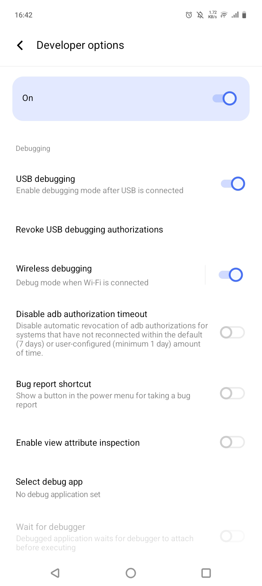
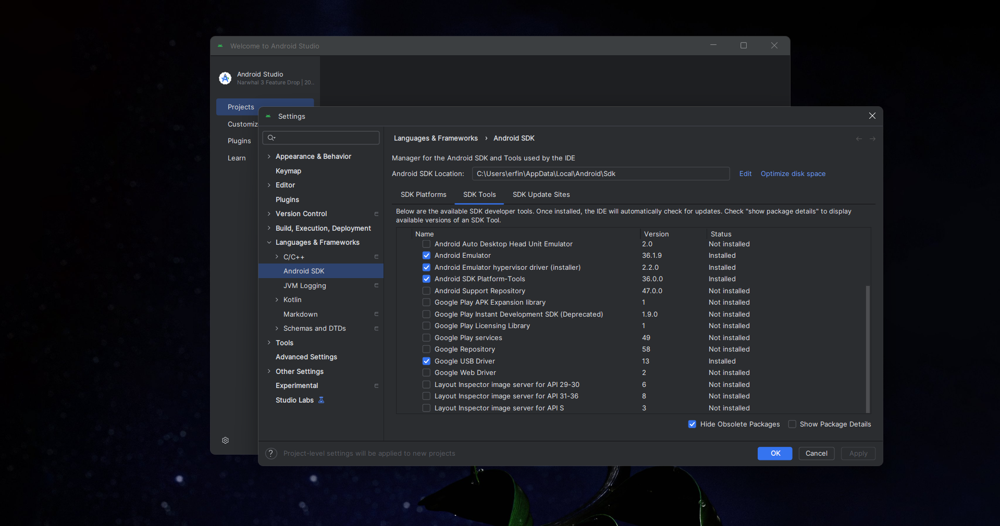

# LAPORAN PRAKTIKUM

## Praktikum 1: Membuat Project Flutter Baru   

* **Langkah 1:** Membuat Project Flutter Baru dan memilih Template Flutter  
     
   

* **Langkah 2:** Memilih Lokasi Project  
   

* **Langkah 3:** Memilih Nama Project  
   

* **Langkah 4:** Flutter Project berhasil dibuat  
   

## Praktikum 2: Menghubungkan Perangkat Android/Emulator

* **Langkah 1:** Mengaktifkan proses debug USB dan Menginstall Driver USB Google  
   
    

* **Langkah 2:** Sambungkan perangkat Android ke komputer menggunakan kabel USB
    

* **Langkah 3:** Menjalankan aplikasi dari Android Studio di perangkat Android Menggunakan kabel USB
    
    

* **Langkah 4:** Sambungkan perangkat Android dan komputer ke jaringan nirkabel yang sama
       

* **Langkah 5:** Scan QR Code dengan perangkat Android
    
    

## Praktikum 3: Membuat Repository GitHub dan Laporan Praktikum

* **Langkah 1-10:** Membuat dan Remote Repository GitHub
    
    