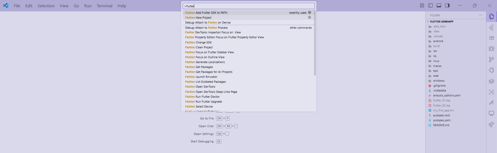
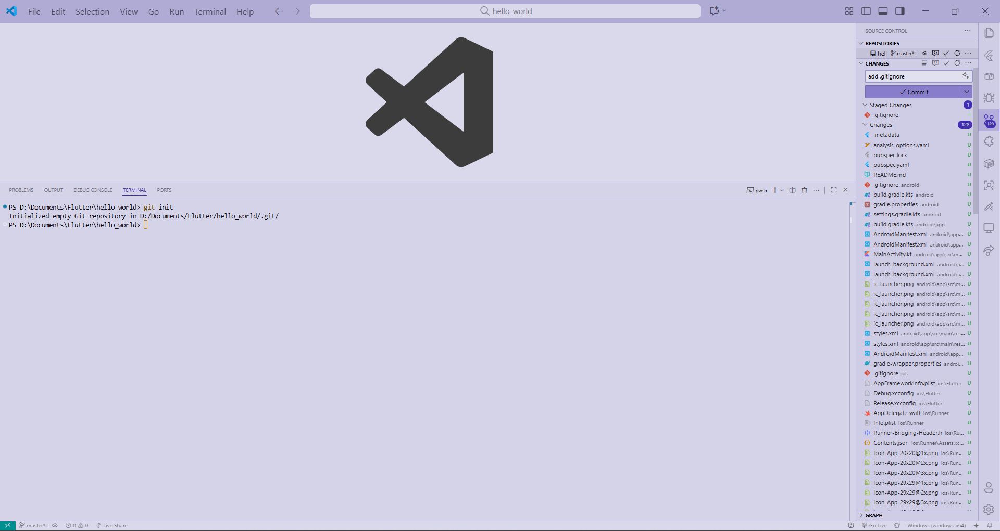
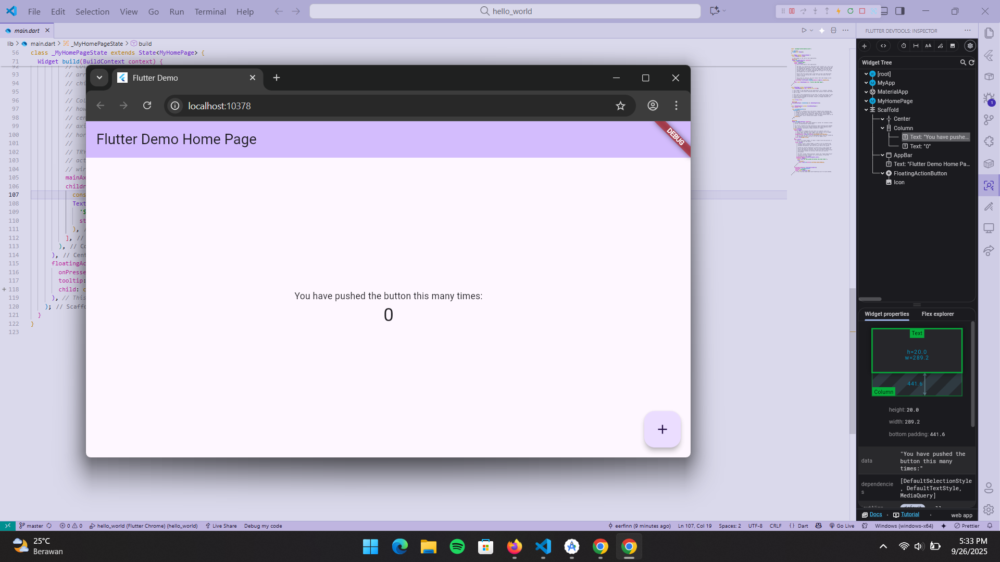
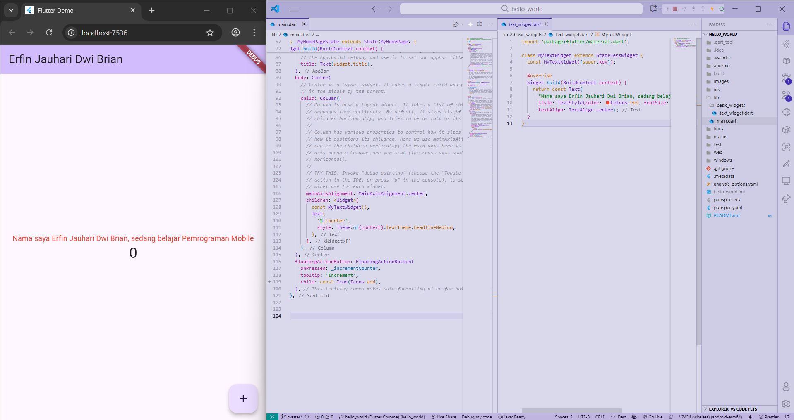
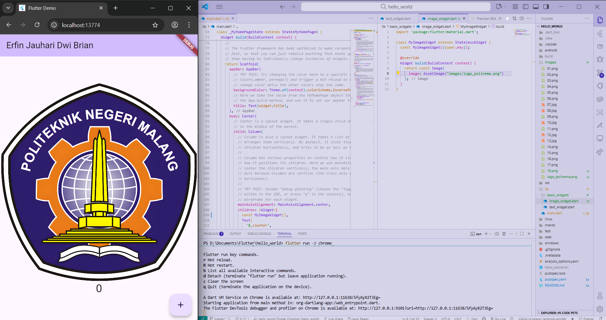
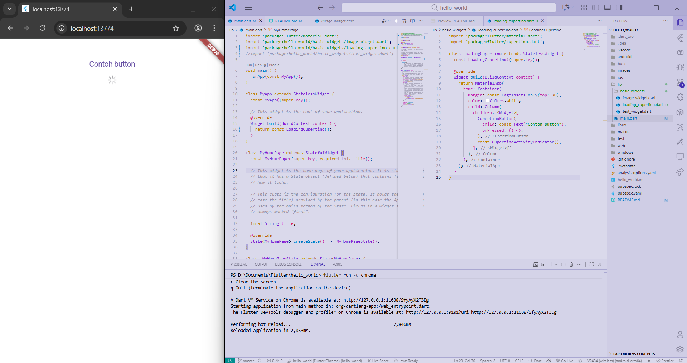
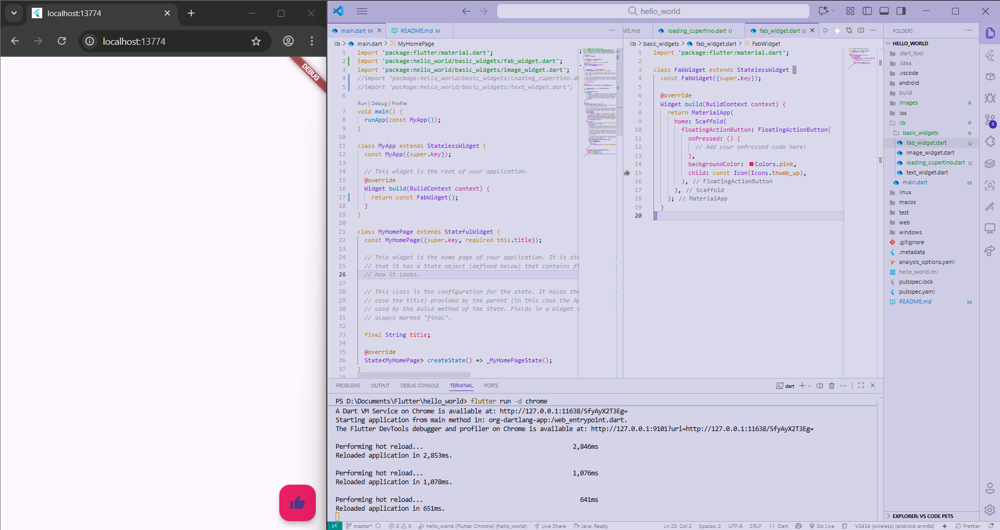
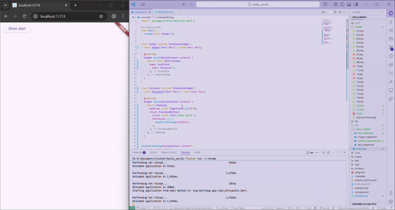
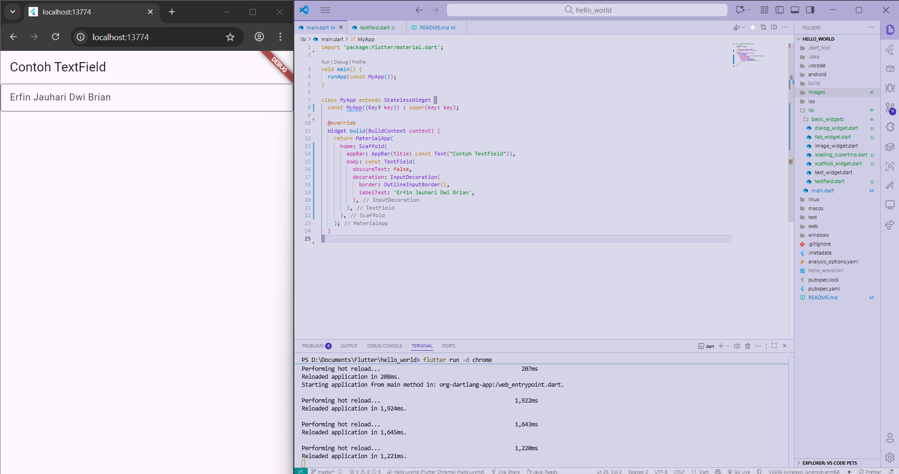
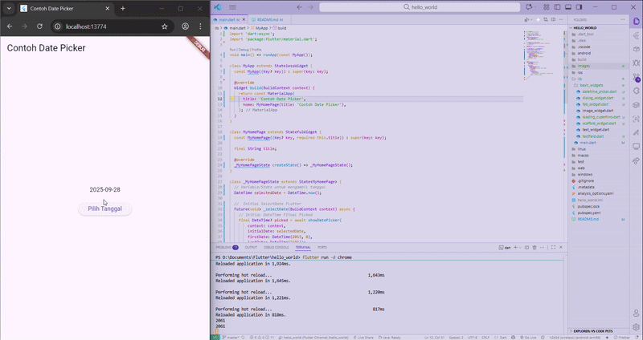

# LAPORAN PRAKTIKUM

## Praktikum 1: Membuat Project Flutter Baru   
### Langkah 1: Membuat Project Flutter Baru dan memilih Template Flutter  
     
   

### Langkah 2: Memilih Lokasi Project  
   

### Langkah 3: Memilih Nama Project  
   

### Langkah 4: Flutter Project berhasil dibuat  
   

## Praktikum 2: Menghubungkan Perangkat Android/Emulator
### Langkah 1: Mengaktifkan proses debug USB dan Menginstall Driver USB Google  
   
   

### Langkah 2: Sambungkan perangkat Android ke komputer menggunakan kabel USB
   

### Langkah 3: Menjalankan aplikasi dari Android Studio di perangkat Android Menggunakan kabel USB
   
   

### Langkah 4: Menjalankan aplikasi di perangkat Android menggunakan Wi-Fi dengan menghubungkan perangkat Android dan komputer ke jaringan nirkabel yang sama
      

### Langkah 5: Scan QR Code dengan perangkat Android
   
    

## Praktikum 3: Membuat Repository GitHub dan Laporan Praktikum
### Langkah 1-10: Membuat dan Remote Repository GitHub
   
   

### Langkah 11: Running project hello_world
   

### Langkah 12: Teks yang ditampilkan dalam aplikasi berupa nama lengkap
   

## Praktikum 4: Menerapkan Widget Dasar
### Langkah 1: Text Widget
   

### Langkah 2: Image Widget
   

## Praktikum 5: Menerapkan Widget Material Design dan iOS Cupertino
### Langkah 1: Cupertino Button dan Loading Bar
   

### Langkah 2: Floating Action Button (FAB)
   

### Langkah 3: Scaffold Widget
   

### Langkah 4: Dialog Widget
   

### Langkah 5: Input dan Selection Widget
   

### Langkah 6: Date and Time Pickers
   